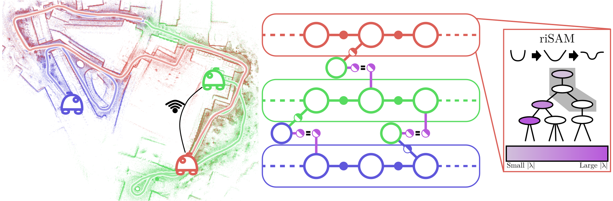
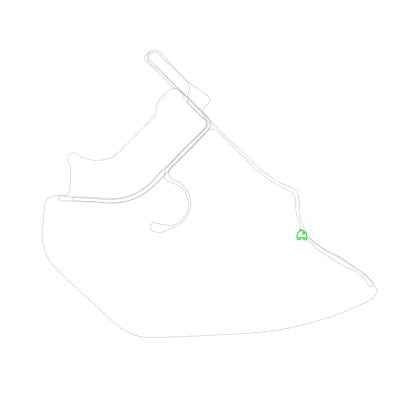
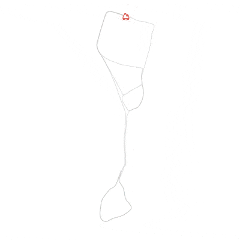
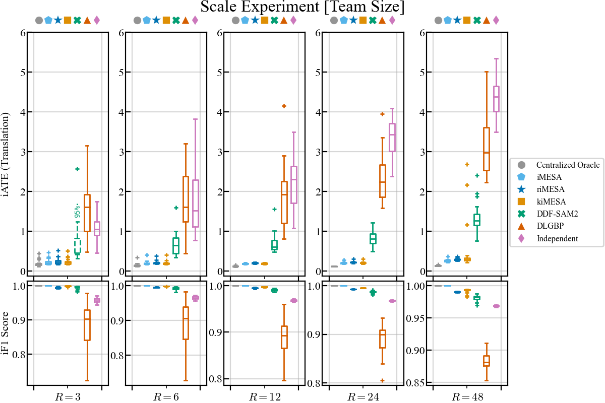

# Robust Incremental Manifold Edge-based Separable ADMM (riMESA)
<p align="center">
<a href="https://rpl.ri.cmu.edu/"></a>
<a href="https://opensource.org/licenses/MIT"></a>
<a href="https://arxiv.org/abs/2603.01178"></a>
<a href="https://ieeexplore.ieee.org/document/11575119"></a>
</p>


<p align="center">

</p>
An illustration of riMESA operating on real-world data (`kth_r3_00_proradio`). riMESA estimates the state of a multi-robot team from noisy, potentially incorrect measurements using only sparse, unreliable communication. riMESA is a C-ADMM-based distributed optimization algorithm in which robots locally constrain shared state using "biased priors". Over time, as communication is available, riMESA tightens equality constraints with dual variables to provide consistent solutions for the team. Meanwhile, robots incorporate new measurements efficiently using the riSAM algorithm, which handles potential outlier measurements using M-Estimations and an incremental version of Graduated Non-Convexity, which efficiently updates only the relevant subproblem at each timestep.

## Abstract

riMESA is a robust incremental distributed back-end algorithm for Collaborative Simultaneous Localization and Mapping (C-SLAM). For real-world deployments, robotic teams require algorithms to compute a consistent state estimate accurately, within online runtime constraints, with limited communication, all while operating robustly to outliers that we expect to corrupt our set of measurements. 

In this package we provide the original implementation of "Robust Incremental Manifold Edge-based Separable ADMM" (riMESA) a fully distributed C-SLAM back-end algorithm that can provide a multi-robot team with robust and accurate state estimates in real-time with only sparse pair-wise communication between robots. This algorithm and a broader use of Consensus ADMM for distributed optimization in robotics can be found in our Transactions on Robotics Paper: "riMESA: Consensus ADMM for Real-World Collaborative SLAM".

If you use this software please cite our TRO paper as follows:

```
@article{mcgann_rimesa_2026, 
    title = {{riMESA}: Consensus {ADMM} for Real-World Collaborative {SLAM}},
    author = {D. McGann and M. Kaess},
    fullauthor = {Daniel McGann and Michael Kaess},
    journal = {IEEE Transactions on Robotics},
    year = 2026
    volume = {}, % Volume not yet available as of June 2026
    number = {}, % Number not yet available as of June 2026
    pages = {},  % Pages not yet available as of June 2026
}
```
Note: riMESA is the culmination of a line of work containing a batch optimizer [MESA](https://github.com/rpl-cmu/mesa) and a incremental (but not robust) algorithm [iMESA](https://github.com/rpl-cmu/imesa). It is recommended that for real world applications practitioners use riMESA due to its advantages over these prior works.

## Example Results

Extensive evaluation on real and synthetic data demonstrates that riMESA is able to provide accurate results across problem scenarios. The code used to generate all results is also made available in the companion repository [COMING SOON](https://github.com/rpl-cmu/rimesa).


Below are example qualitative results from trials from the [COSMO-Bench](cosmobench.com) benchmark for collaborative SLAM.

<p align="center">


riMESA Qualitative Results on COSMO-Bench Wifi Datasets
</p>

<p align="center">





riMESA Qualitative Results on COSMO-Bench ProRadio Datasets
</p>

In the associated publication we present results from over 2400 simulated trials where we explore various problem formulations (e.g. Pose-Graph Optimization, landmark SLAM, Range Aided SLAM) and and problem scales (e.g. operation time, and team size). We further provide detailed comparisons against comparable state-of-the-art methods. Below we include an example from these results that show riMESA is able to scale efficiently to even large multi-robot teams.




## Documentation
We provide the implementation of riMESA as a simple C++ library. This library is quite similar to the prior work iMESA for experienced users. The library provides a class `RIMESA` that can be used on-board each robot in a multi-robot team to solve their collaborative state estimate using the riMESA algorithm. Practically, this class is used much like existing incremental SLAM solvers like `ISAM2` as provided by `gtsam`, with extensions to perform communications with other robots in parallel threads (using the `CommunicationHandler`) and incorporate information from these communications to improve local estimates.

See `include/rimesa/rimesa.h` for inline documentation on this class's interface. Additionally, see our [experiments repository (COMINE SOON)](https://github.com/rpl-cmu/rimesa) for an example of how this library can be used. The best place for documentation on the algorithm itself is the paper discussed above!


### Variable Conventions
riMESA uses uses the keys of variables to implicitly identify which variables are shared with other robots. The library assumes that all variable keys are represented according to the `gtsam::Symbol` convention and consist of a character that denotes the unique identifier of the robot that owns the variable and a integer representing that index of the variable. For example the 15th pose of robot "a" will be `a15`. The riMESA algorithm identifies shared variables as any variable with a key denoting that it is owned by another robot.

This library also provides functionality to handle "global variables" that are variables in the SLAM optimization that do not necessarily belong to any singular robot (i.e. landmarks). Such variables are marked with a `#` character in their variable key. Handling these variables requires some additional information to be shared during communication (keys of global vars). This functionality was not explicitly discussed in the paper above, but has been tested and users are safe to use this functionality!

## Dependencies
The key dependency for riMESA is [GTSAM](https://github.com/borglab/gtsam). riMESA is sensitive to the version of GTSAM used. We have tested riMESA with GTSAM version `4.2.0` and recommend its use. 

riMESA additionally needs some development functionality in GTSAM that unfortunately is not included in any tagged release. The details of these changes are summarized in this [pull request](https://github.com/borglab/gtsam/pull/1504). For convenience we provide these changes cherry-picked onto GTSAM `4.2.0` via our [fork](https://github.com/DanMcGann/gtsam) under branch `4.2.0-imesa`. Note: This changes are needed for "Split" Biased Priors which are not recommended for use and not evaluated in the riMESA paper. We may remove Split Biased Priors and inturn the need for this specialized GTSAM versioning in future releases. 

riMESA also depends on our robust incremental solver riSAM for its internal optimization. This dependency is automatically retrived using `FetchContent` but can be inspected [HERE](https://github.com/rpl-cmu/risam-v2).

## Installation Instructions

As this package is only a library it is most frequently will be used as a 3rd party dependency within your project. We encourage users to use `FetchContext` to access and make the riMESA library available within their own project. 

You can include riMESA as a dependency in your project by adding the following to your `CMakeLists.txt` file:

```
include(FetchContent)
FetchContent_Declare(
  rimesa
  GIT_REPOSITORY  https://github.com/rpl-cmu/rimesa.git 
  GIT_TAG         main
)
FetchContent_MakeAvailable(rimesa)
```

The project in which riMESA is used will need to be build against the GTSAM version discussed above. An example of this in practice can be found in the [experiments repository (COMING SOON)](https://github.com/rpl-cmu/rimesa).

# Issues
If you encounter issues with this library please fill out a bug report on github with details on how to reproduce the error!